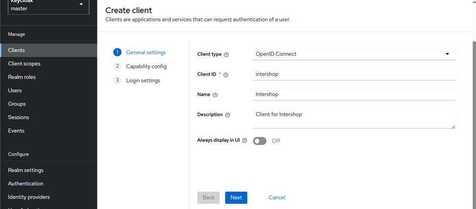
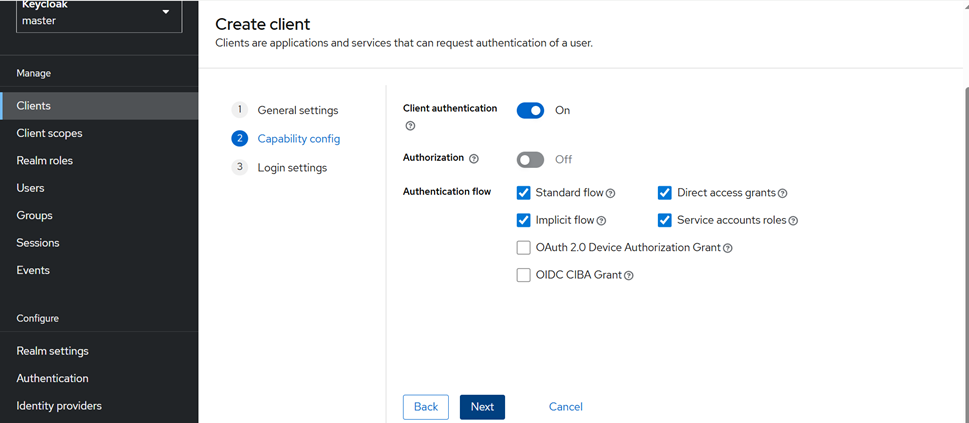
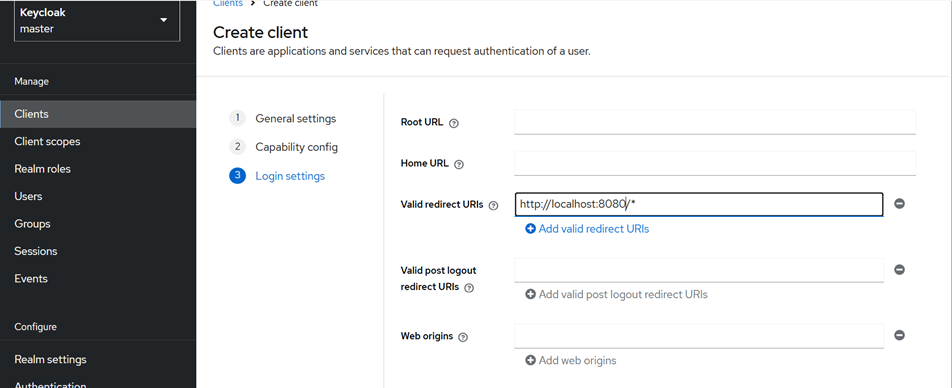
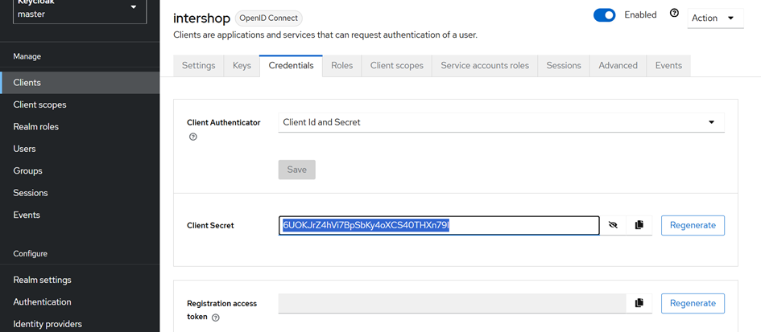
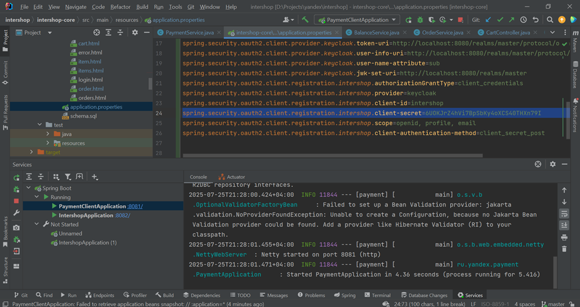

<i><small>для добавления товара необходимо перейти по адресу /items/add</small></i>
<h1>Витрина</h1>

Веб-приложение представляет собой витрину товаров, которые пользователь может положить в корзину и купить.
Приложение состоит из шести основных частей (модулей): 

<li>страница витрины товаров, доступных для просмотра и покупки; </li>
<li>страница товара; </li>
<li>страница корзины покупателя;</li>
<li>страница всех заказов;</li>
<li>страница заказа;</li>
<li>сервис покупки.</li>

Страница витрины товаров — это веб-страница (html + javascript), на которой представлены:
<li>список товаров, доступных для заказа (картинка, название, цена, кнопка добавления в корзину/удаления из неё, кнопка изменения количества товара в корзине);</li>
<li>список товаров может быть представлен в любом виде (списком, плиткой);</li>
<li>есть пагинация (по 10, 20, 50, 100 товаров);</li>
<li>сверху строка поиска с фильтрацией по названию (можно просто по вхождению слова в название/описание товара);</li>
<li>сверху доступна фильтрация по цене, алфавиту.</li>

При нажатии на товар происходит переход на веб-страницу карточки товара, на которой представлены:

<li>название, картинка, описание товара, возможность положить товар в корзину/удалить его, изменить количество в корзине;</li>
<li>цена товара.</li>

В правом верхнем углу любой веб-страницы есть кнопка перехода в корзину, которая представляет собой:
веб-страницу со списком положенных в неё товаров, их количеством, ценой каждого товара и общей ценой всей корзины;
есть возможность удалить товар из корзины, изменить его количество;
есть кнопка оформления заказа.

В правом верхнем углу любой веб-страницы есть кнопка перехода на страницу заказов, которая представляет собой:
веб-страницу со списком всех оформленных заказов, суммой каждого заказа и общей суммой всех заказов;
при нажатии на заказ появляется веб-страница совершённого заказа.

На веб-странице заказа представлен список купленных товаров (картинка, название, цена).

При нажатии на кнопку оформления заказа происходит эмуляция оформления заказа, при этом происходит переход на страницу оформленного заказа.

Есть возможность загрузки списка товаров на витрину товаров (на ваше усмотрение: можно сделать веб-интерфейс добавления товара, импорт из файла и так далее).

<h1>Описание</h1>
<h3>Главная страница <i>/items</i></h3>

На главной странице находятся элементы, содержащие информацию о товарах (заголовок, изображение, количество товара в корзине). 
Количество постов, отображаемых на странице, можно выбрать из предложенного списка. 

С помощью поля "Найти" можно произвести поиск товаров.

Нажав на товар, можно перейти на страницу с информацией о нем.

<h3>Страница товара <i>/items/id</i></h3>

Содержит подробную информацию о товаре - название, изображение, описание, цену, а также кнопку добавления в корзину.

Кнопка "Главная" предназначена для перехода на страницу со всеми товарами. 

Кнопка "Корзина" предназначена для перехода на страницу с корзиной. 

Кнопка "Заказы" предназначена для перехода на страницу с заказами. 

<h3>Страница добавления товара <i>/items/add</i></h3>
<h4>Для перехода на страницу необходимо перейти по адресу <i>/items/add</i>.</h4>

Поле "Название" служит для добавления названия.

Поле "Изображение" служит для загрузки изображения для товара.

Поле "Описание" служит для добавления описания товара.

Поле "Цена" служит для добавления цены товара.

Кнопка "Сохранить" необходима для сохранеия введенных данных.

<h3>Корзина <i>/cart/items</i></h3>

Содержит информацию о товарах, добавленных в корзину.

Кнопка "Главная" предназначена для перехода на страницу со всеми товарами. 

Кнопка "Заказы" предназначена для перехода на страницу с заказами. 

Кнопка "Купить" предназначена для оформления заказа. Доступна, если сервис платажей доступен и достаточно средств для оплаты. 

<h3>Заказы <i>/cart/items</i></h3>

Содержит информацию о совершенных заказах.

Кнопка "Главная" предназначена для перехода на страницу со всеми товарами. 

Кнопка "Корзина" предназначена для перехода на страницу с корзиной. 

<h1>Запуск</h1>

Запустить KEYCLOAK командой <b>docker run -d -p 8082:8080 --name keycloak -e KC_BOOTSTRAP_ADMIN_USERNAME=admin -e KC_BOOTSTRAP_ADMIN_PASSWORD=admin quay.io/keycloak/keycloak:26.1.3 start-dev</b>

Настроить клиента:

<li>Перейти по ссылке http://localhost:8082</li>
<li>Авторизоваться в сервисе - admin/admin</li>
<li>Создать нового клиента со следующими параметрами:</li>

<li>Скопировать Client Secret</li>

<li>Скопированный секрет передать в качестве параметра client-secret в файле application.properties основного модуля intershop-core:</li>

<i>при запуске сборки порт 6379 должен быть свободен для тестов</i>

Собрать проект командой <b>mvn package</b> из основной папки /intershop

Запустить его модули: 

<li>в Unix-системе <b>sh run.sh</b></li>
<li>в Windows-системе <b>./run.cmd</b></li>

Запустить Redis-server на 6379 порту.

<h3>ПОЛЬЗОВАТЕЛИ СИСТЕМЫ:</h3>
<li>admin (admin/password) - имеет доступ к эндпоинту /items/add для добавления товаров.</li>
<li>user (user/password) - может добавлять в корзину товары и оформлять заказ.</li>
<li>анонимный пользователь - может просматривать товары, но не покупать их.</li>

